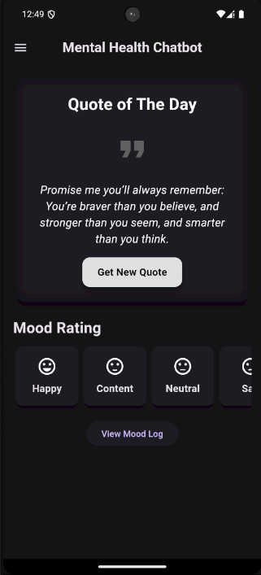
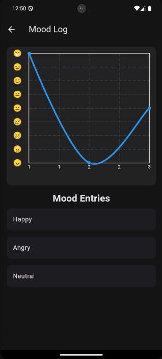
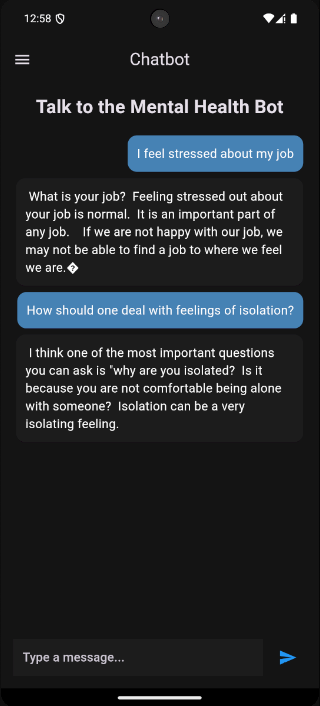
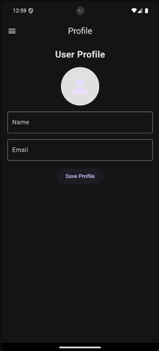
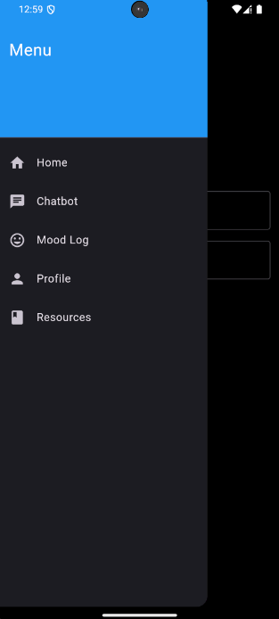
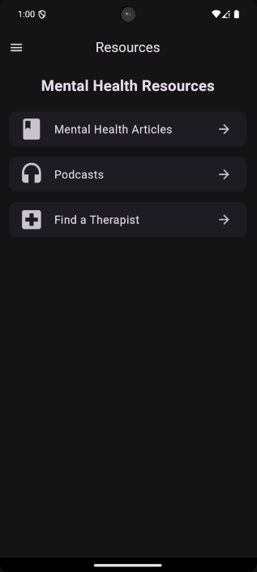

# 🧠 MindEase – Mental Health Chatbot

**MindEase** is an empathetic, AI-powered mental health chatbot built with Flutter and powered by a fine-tuned BlenderBot model. It offers a supportive conversational experience for users dealing with stress, anxiety, or emotional struggles. With a beautiful and responsive UI and a secure Flask backend exposed via Ngrok, MindEase is a smart, mobile-first mental health companion.

---

## 🚀 Features

- 🤖 **AI-Powered Conversations** – Built on a fine-tuned BlenderBot to deliver natural, human-like responses.
- 💬 **Emotionally Supportive** – Specifically trained for mental health topics with a calm, compassionate tone.
- 📱 **Flutter Mobile App** – Cross-platform UI for both Android and iOS.
- 🌐 **Flask + Ngrok Backend** – Local model API securely tunneled and accessible to the mobile frontend.

---

## 🛠️ Tech Stack

| Frontend | Backend       | AI Model                  |
| -------- | ------------- | ------------------------- |
| Flutter  | Flask + Ngrok | BlenderBot (Hugging Face) |

---

## 📸 Demo Screenshots

<h4 align="center">🖼️ App UI Screens</h4>

<p align="center">
  
  
  
</p>

<p align="center">
  
  
  
</p>

<p align="center">
  <sub>
    🏠 Home &nbsp; | &nbsp; 📓 Mood Log &nbsp; | &nbsp; 💬 Chatbot <br/>
    🔐 Login &nbsp; | &nbsp; 📂 Sidebar &nbsp; | &nbsp; 📚 Resources
  </sub>
</p>

---

## 🧩 Installation & Setup

### 1️⃣ Clone the Repository

```bash
git clone https://github.com/yourusername/mindease.git
cd mindease
```

### 2️⃣ Run the Flask Backend

Open `setup.ipynb` in **Google Colab** or **Jupyter Notebook** and run all cells. This will:

✅ Install the necessary dependencies:

```bash
!pip install transformers
!pip install --upgrade transformers
!pip install Flask pyngrok
!pip install flask-cors
```

✅ Load the fine-tuned BlenderBot model:

```python
BlenderBot.from_pretrained("SomeUser675/mentalconvobot")
```

✅ Start the Flask server and expose it via Ngrok:

```python
url = ngrok.connect(5000)
print(f"Public URL: {url}")
```

⚠️ **Important**: Copy the `ngrok` URL printed in the output. You'll use this in your Flutter app as the API base URL.

---

### 3️⃣ Run the Flutter App

1. Open the Flutter app folder.
2. Navigate to `lib/screens/chatbot_screen.dart`.
3. Replace the placeholder API base URL with the copied `ngrok` URL.
4. Run the app:

```bash
flutter pub get
flutter run
```

---

## ⚠️ Limitations

- This app is **not a substitute** for professional therapy or mental health care.
- AI-generated responses may not always be accurate or suitable.
- Requires a stable internet connection (due to ngrok-based API exposure).
